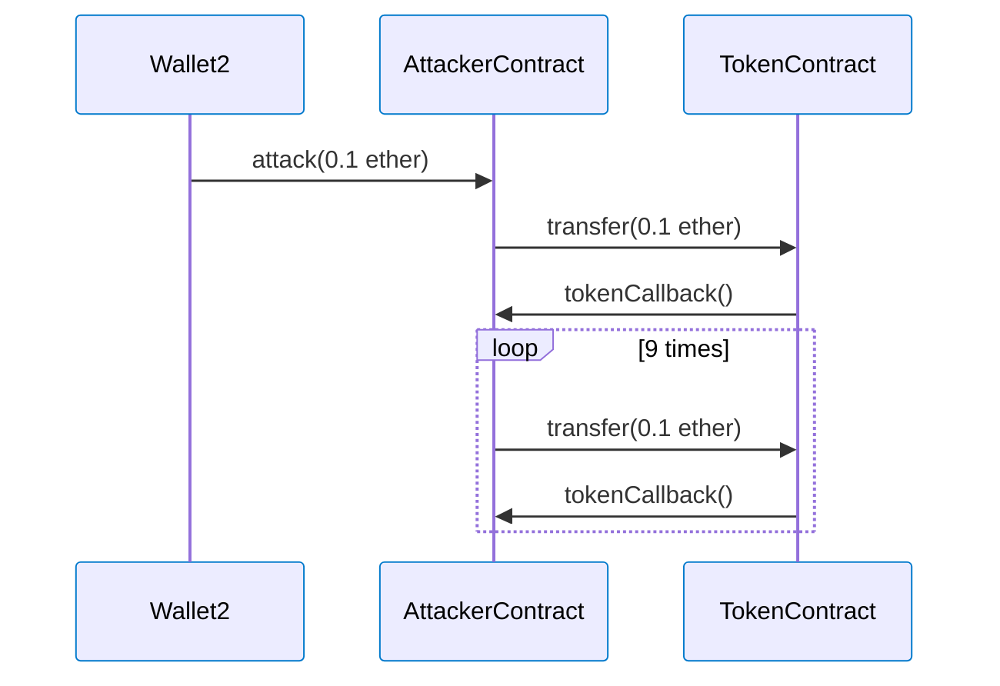

```mermaid
%%{init: {'theme': 'default', 'themeVariables': {
  'primaryColor': '#f2f2f2',
  'primaryTextColor': '#000',
  'actorBackground': '#e6f7ff',
  'actorBorder': '#007acc',
  'lineColor': '#007acc',
  'sequenceNumberColor': '#000',
  'background': '#ffffff'
}}}%%
sequenceDiagram
    Wallet2->>AttackerContract: attack(0.1 ether)
    AttackerContract->>TokenContract: transfer(0.1 ether)
    TokenContract->>AttackerContract: tokenCallback()
    loop 9 times
        AttackerContract->>TokenContract: transfer(0.1 ether)
        TokenContract->>AttackerContract: tokenCallback()
    end

```

