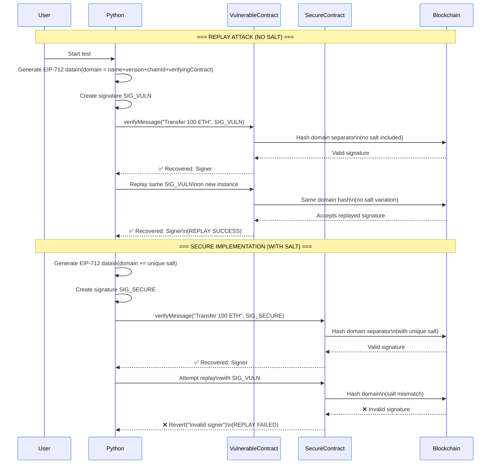

<!--
 * @Author: ashokkasthuri ashokk@smu.edu.sg
 * @Date: 2025-04-21 16:28:28
 * @LastEditors: ashokkasthuri ashokk@smu.edu.sg
 * @LastEditTime: 2025-04-29 10:30:11
 * @FilePath: /ERC-analysis-master/salt_singnature_attack.md
 * @Description: 这是默认设置,请设置`customMade`, 打开koroFileHeader查看配置 进行设置: https://github.com/OBKoro1/koro1FileHeader/wiki/%E9%85%8D%E7%BD%AE
-->

